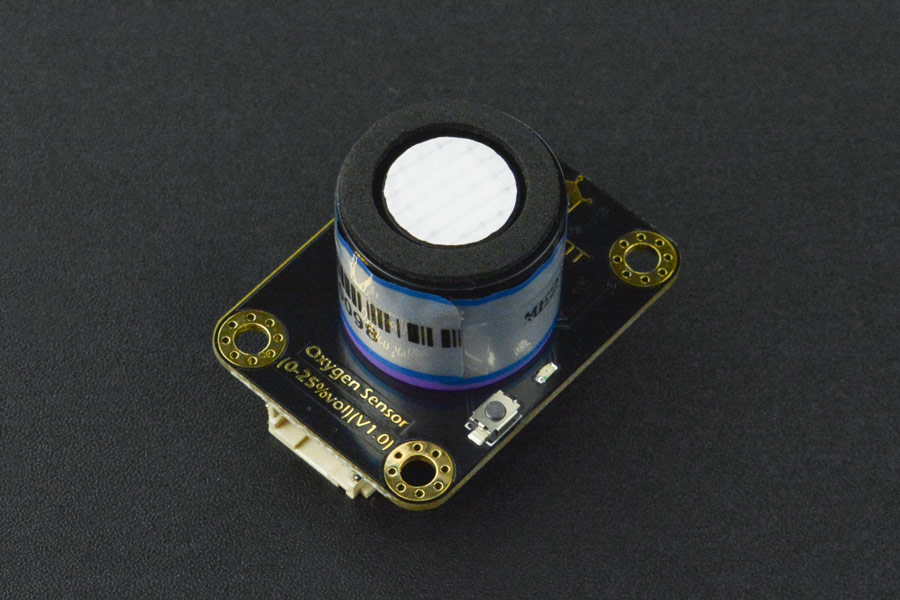

# DFRobot_OxygenSensor
- [中文版](./README_CN.md)

The Gravity: I2C Oxygen Sensor is based on electrochemical principles and it can measure the ambient O2 concentration accurately and conveniently. Its effective range is 0~25%Vol. The sensor boasts high precision, high sensitivity, wide linear range, high anti-interference ability, high stability, and good repeatability. When equipped with an I2C interface, the sensor can read the ambient O2 concentration easily, meanwhile, it can also work with various MCU and sensors. This Arduino-compatible oxygen sensor can be widely applied to fields like industries, mines, warehouses, and other spaces where the air is not easy to circulate as well as to measure the oxygen concentration in the environment.




## Product Link（https://www.dfrobot.com/product-2052.html）

    SKU：SEN0322

## Table of Contents

* [Summary](#Summary)
* [Installation](#Installation)
* [Methods](#Methods)
* [Compatibility](#Compatibility)
* [History](#History)
* [Credits](#Credits)

## Summary

* Effective range: 0-25%Vol

* Compatible with both 3.3V and 5V micro-controllers (Note: it can be powered by 5V when using devices of 3.3V)

* Fast calibration function, I2C digital output, reverse connection protection, etc.

## Installation
Download the library file before use, paste it into the custom directory for Raspberry Pi, then open the examples folder and run the demo in the folder.

## Methods

```python
  def calibrate(self, vol, mv):
    '''!
      @brief Calibrate sensor
      @param vol Oxygen concentration unit vol
      @param mv Calibrated voltage unit mv
      @return None
    '''

  def get_oxygen_data(self, collect_num):
    '''!
      @brief Get oxygen concentration
      @param collectNum The number of data to be smoothed
      @n     For example, upload 20 and take the average value of the 20 data, then return the concentration data.
      @re
```

## Compatibility

* RaspberryPi Version

| Board        | Work Well | Work Wrong | Untested | Remarks |
| ------------ | :-------: | :--------: | :------: | ------- |
| RaspberryPi2 |           |            |    √     |         |
| RaspberryPi3 |     √     |            |          |         |
| RaspberryPi4 |           |            |    √     |         |

* Python Version

| Python  | Work Well | Work Wrong | Untested | Remarks |
| ------- | :-------: | :--------: | :------: | ------- |
| Python2 |     √     |            |          |         |
| Python3 |           |            |    √     |         |


## History

- 2019/10/25 - V0.2.0 version

- 2021/10/22 - V1.0.0 version


## Credits

Written by ZhixinLiu(zhixin.liu@dfrobot.com), 2021. (Welcome to our [website](https://www.dfrobot.com/))
